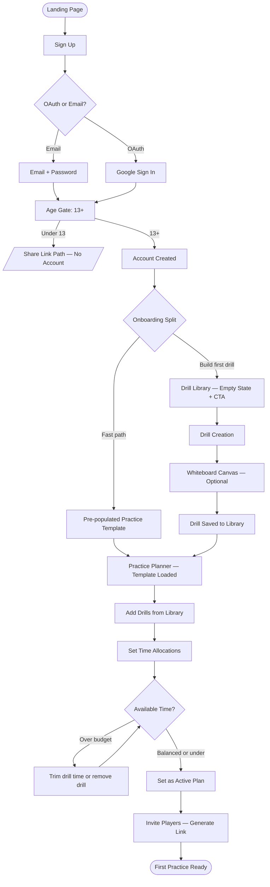
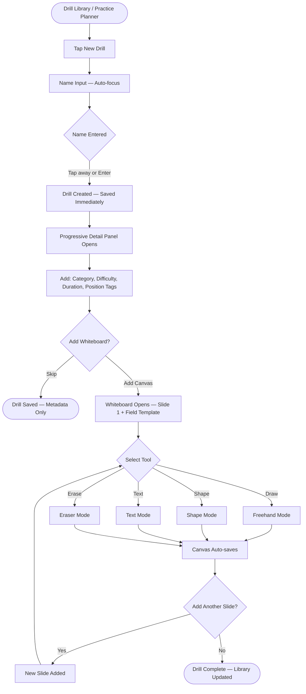
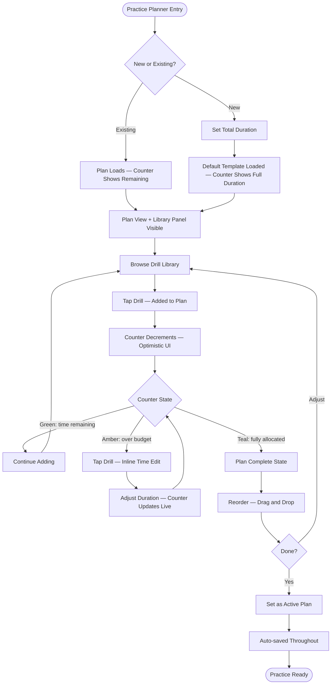
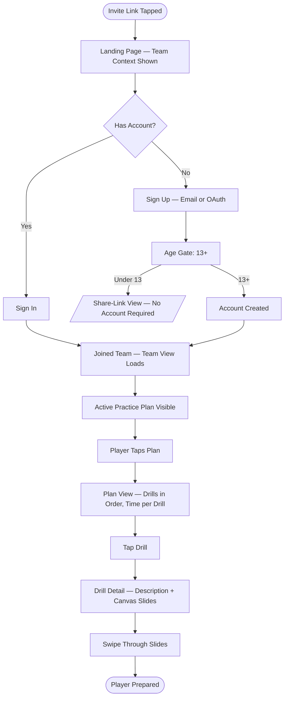

# UX Design Specification minuteXminute2

**Author:** Derek
**Date:** 2026-02-26

---

<!-- UX design content will be appended sequentially through collaborative workflow steps -->

## Executive Summary

### Project Vision

MinuteXMinute 2.0 is a practice-first coaching PWA for lacrosse coaches and
players. The core product bet: no existing tool owns the full loop of drill
library → practice composition → player preparation → off-practice development.
The MVP closes that gap. Every UX decision flows from one outcome — making the
team better, one purposeful rep at a time.

### Target Users

**Coach (Marcus)** — Primary creator. Builds and maintains a drill library,
composes timed practice plans, assigns home practice, and monitors player
engagement. Device context: mobile-first (field planning + on-field reference),
tablet secondary, desktop tertiary. Needs the app to be viable during live
practice, not just in planning sessions.

**Team Player (Jordan)** — Read-only consumer. Reviews upcoming practice plans
and drills before each session. Phone-first. Use case ranges from quick
glanceable check ("what are we doing today") to going deep into individual drill
content. Both modes must work well on mobile.

**Solo Player (Alex)** — Self-directed. No team context in MVP; arrives via
Social Hub in Phase 2. Browses public drills and builds a personal practice
list. Relevant for cold-start design: the product should be valuable to a
browsing user before they have a team or coach.

### Key Design Challenges

**1. Mobile-first canvas/whiteboard**
Drawing lacrosse formations on a phone is a hard UX problem. Touch-based
drawing, zoom/shift of field templates, locking a template region, placing
symbols and arrows — all on a 375px-wide screen. Mobile canvas tools have no
settled convention. This requires deliberate interaction design and likely the
most prototype/test iteration of any feature in MVP.

**2. Multi-role information architecture**
Coach and player have fundamentally different experiences — creator vs.
consumer. The solution: a role-specific shell/layout (navigation, entry points)
with shared inner components using a compound component pattern. The card
structure holds shared zones (drill name, duration, tags) plus role-specific
slots (coach actions, player actions). Data filtering happens at the API layer —
components receive clean, role-appropriate data and never branch on role
internally.

**3. Practice composition on mobile**
The time-tracking, drill-sequencing practice planner is the core differentiator.
Reordering drills, adjusting per-drill time allocation, and tracking "time
remaining" needs to feel fast and tactile on mobile — not like filling out a
spreadsheet. This is the hero interaction; it needs the most UX investment after
the canvas.

**4. Cold-start friction**
The app's value depends on pre-existing data (drills, team). A new coach has
none. Template drills reduce this, but the path from "new account" to "first
useful thing happened" must be short. Team creation is optional and skippable
at onboarding — coaches can build drills and a practice plan before setting up
a team.

**5. On-field glanceability**
Coaches referencing the app during live practice need a different interaction
mode than planning sessions: glanceable plan view, large touch targets, minimal
taps to see "what's next." The planning UI and the on-field reference UI may
need to be the same screen optimized for both contexts, or a dedicated "practice
mode" view.

### Design Opportunities

**1. Practice composer as hero UX**
If the time-allocation + drill-sequencing flow is fast and satisfying on mobile,
that's the moment coaches convert. This interaction — adding a drill, setting
its time, watching "available time" tick down — should feel like a smart
assistant, not a form. Worth over-investing in this flow.

**2. Player pre-practice moment**
Jordan opening the app 5 minutes before practice and seeing a clean, scannable
plan with drills already loaded is the product's aha moment for players. A view
optimized for "quick scan, I know what's coming" is a small surface with
outsized impact on player retention.

**3. Whiteboard as brand expression**
The dry-erase motif maps directly to how coaches already think — drawing on a
real whiteboard is their mental model. Design the canvas to feel like "marker on
a whiteboard" rather than "drawing tool on a screen." Field template + lock
mechanic mirrors picking up a marker. This is where the brand's dry-erase
character comes alive functionally, not just visually.

**4. Progressive onboarding via templates**
Pre-loaded lacrosse drill templates let a new coach experience the product loop
before building anything from scratch. Goal: new account → first practice plan
using templates → "I get it" moment — in under 10 minutes.

**5. Team code join**
Code-based player onboarding (coach shares a team code, players join directly)
removes the email-invite overhead and makes team setup feel lightweight. This
also enables future QR code sharing on-field.

---

## Core User Experience

### Defining Experience

MinuteXMinute 2.0 is built around one core loop: **coach creates a practice plan → plan runs on the field → players arrive prepared**. The hook that converts a new coach from "trying this" to "using this" is the practice plan creation experience. Whiteboard drill design is the quality bar — if the tools don't feel right, trust in the product collapses — but the moment a coach builds a complete, time-allocated practice plan is the moment they commit to the product.

Drills are coach-owned, not team-owned. A coach's library persists regardless of team context, and practice plans can exist as standalone coach artifacts with no team association. This decouples the most valuable content creation work from the team setup step.

The primary user driving all core experience decisions is the **Coach**. Player experience is a compounding benefit of a well-designed coach experience.

### Platform Strategy

**Primary:** Mobile-first PWA — coaches plan on desktop and reference on mobile. The interaction model must be defined for touch, then enhanced for mouse and keyboard.

**Desktop:** Equally important for planning sessions. Practice plan composition, drill library management, and whiteboard creation all benefit from a larger canvas and keyboard. Desktop is not an afterthought.

**Offline (MVP):** Most recent practice plan is cached and readable without signal. Editing offline is out of scope for MVP. Full offline sync with conflict resolution is a stretch target evaluated at end of MVP based on implementation overhead.

### Effortless Interactions

**Adding a drill to a practice plan** must be a single gesture — browse library, tap, done. No confirmation dialogs, no form filling, no navigation away from the plan. Available time counter updates immediately.

**Reordering the practice plan** must be drag-and-drop on both mobile and desktop. A coach should rearrange an entire session in under 30 seconds.

**Whiteboard tool selection** must be immediately obvious. The primary mobile failure mode is selecting the wrong tool — accidentally scrolling the canvas when trying to draw, or drawing when trying to zoom. Active tool state must be unambiguous at all times.

### Critical Success Moments

**The hook:** A coach completes their first practice plan — drills added, time allocated, plan looks right. This is the "I get it" moment. Everything before it is onboarding friction; everything after is retention.

**Onboarding split path:** New coaches arrive at a choice — build from a default practice plan (pre-populated with template drills, ready to customize) or create a drill from scratch. Team creation is optional and deferred — a coach can build a full drill library and compose a complete practice plan before a team exists. The team layer is additive, not a gate.

**Whiteboard quality bar:** The first time a coach draws a formation is a make-or-break quality test. If the field template stays locked and the drawing layer responds correctly, confidence in the entire product goes up. If drawing is imprecise or tools misbehave, that confidence collapses.

### Experience Principles

1. **Practice plan is the hero.** Every navigation, loading state, and empty state — optimize for getting a coach to a complete practice plan faster.
2. **Whiteboard is the quality bar.** The right tool must always be active and obvious. Accidental tool switches are the primary mobile failure mode — prevent them by design.
3. **Default state over empty state.** Pre-populated template drills and a default practice plan structure eliminate cold-start friction and accelerate the hook moment.
4. **Touch-first, mouse-enhanced.** All interactions must work on mobile touch. Desktop adds keyboard shortcuts and larger canvas — it never defines the interaction model.
5. **Fewer steps, more momentum.** The path from "open app" to "practice plan ready" must require the fewest possible decisions. Remove confirmations, pre-select sensible defaults, batch actions where possible.
6. **Coach before team.** A coach can create drills, build practice plans, and experience full product value before creating or joining a team. Team setup is an enhancement to an already-useful tool, not a prerequisite.

---

## Desired Emotional Response

### Primary Emotional Goals

**Coach (Marcus):**
- **During plan creation:** In control and focused. The app is a tool the coach commands — not a system they navigate around. The experience should feel like calling plays, not filling out a form.
- **Post-practice:** Smooth, earned satisfaction — "hot damn, that was smooth." The feeling that comes from a practice that ran exactly as planned. This is the moment that creates retention.
- **Over time:** Progress through challenge. The core differentiating emotion — a coach should feel their team is measurably improving because of how they're using this tool. Library growth, plan refinement, and player engagement signals all feed this feeling.

### Emotional Journey Mapping

| Stage | Target Emotion | Notes |
|---|---|---|
| Discovery | Credible curiosity | Does this look like a real tool for real coaches? |
| First use | Oriented, not lost | Default practice plan removes the "where do I start?" anxiety |
| Plan creation | Focused, in control | One clear action at a time; the available time counter creates momentum |
| Plan complete | Smooth satisfaction | The "hot damn" moment — earned, not empty |
| Error / recovery | Fixable, not punished | Errors should surface a clear path forward immediately |
| Return visit | Growing competence | Library is bigger, plans are sharper, team is better |

### Micro-Emotions

- **Confidence over confusion** — especially at whiteboard tool selection and navigation entry points; ambiguity here breaks trust fast
- **Trust over skepticism** — the app does exactly what it appears to do; no unexpected state changes or lost work
- **Accomplishment over frustration** — every completed action (drill added, plan saved, plan run) should land with a small sense of done
- **Progress over stagnation** — the visible growth of the drill library and practice history should make coaches feel the arc of improvement

### Emotions to Avoid

- **Overwhelmed** — too many options visible at once, unclear hierarchy, competing calls to action
- **Confused** — ambiguous tool states, unclear active selection on whiteboard, navigation that doesn't signal where you are
- **Frustrated** — interactions that require more steps than feel necessary, especially on mobile
- **Unintuitive** — having to figure out how something works rather than it feeling obvious on contact

### Design Implications

| Emotional Goal | UX Design Approach |
|---|---|
| In control + focused | Minimal UI chrome; one primary action per screen; clear visual hierarchy |
| "Hot damn, smooth" | Micro-interactions on key completions; drag-and-drop that snaps cleanly; time counter that responds immediately |
| Progress through challenge | Visible library growth; practice history; player engagement signals surfaced to coach |
| Avoid overwhelmed | Progressive disclosure; advanced options behind secondary actions |
| Avoid confused | Persistent active-state clarity on whiteboard; consistent nav patterns; no hidden state changes |
| Avoid frustrated | Instant feedback on every action; undo always available; no dead ends |

### Emotional Design Principles

1. **Control is earned through clarity.** A focused UI reduces noise so the coach's decisions feel intentional, not reactive. Remove anything that competes with the primary action on screen.
2. **Smoothness is a feature.** The "hot damn" moment is designed, not accidental — transitions, snap feedback, and responsiveness all contribute to it.
3. **Progress is visible.** The app should make coaches feel their team is getting better because of what they're building. Library growth, plan iteration, and engagement signals serve this feeling.
4. **Errors are speed bumps, not walls.** Recovery from any error must be immediate and obvious. Coaches on a field don't have patience for dead ends.
5. **Trust through predictability.** The app does what it says and shows what it's doing. No surprises, no lost work, no state changes a coach didn't initiate.

---

## UX Pattern Analysis & Inspiration

### Inspiring Products Analysis

**Hudl** — Video analysis and team management platform widely used by coaches.
- *What they do well:* Tag-based content organization; drill/play categorization that makes large libraries navigable; structured data presentation coaches already recognize.
- *Where they fall short:* Navigation complexity that overwhelms on mobile; desktop-first architecture not suited for field use; zero practice planning capability.
- *Relevance to MxM:* Coaches who use Hudl will recognize category/tag filtering patterns. MxM borrows the organizational model and strips the cognitive overhead.

**SportsYou** — Team communication and scheduling app.
- *What they do well:* Very low friction for posting and sharing; familiar social-feed card pattern coaches immediately understand; simple team invite flow.
- *Where they fall short:* No structured practice planning, no drill management, no depth. Coaches use it because it's simple, not because it's powerful.
- *Relevance to MxM:* Card-based content patterns and simple team join mechanics worth borrowing. The simplicity ceiling is exactly what MxM must break through while keeping the same accessibility.

**Canvas/drawing apps (Procreate / GoodNotes)** — Reference for whiteboard interaction model.
- *What they do well:* Mode-explicit tool selection — active tool is always visually unambiguous; touch targets sized for fingers; undo gesture as muscle memory; pinch-to-zoom that never conflicts with draw mode.
- *Relevance to MxM:* The whiteboard quality bar requires borrowing these conventions. Mode clarity and gesture non-conflict are the primary lessons.

**List/plan builders (Linear, Notion)** — Reference for practice plan reordering.
- *What they do well:* Visible drag handles; immediate visual feedback during reorder; auto-scroll when dragging to list edges; keyboard accessibility for power users.
- *Relevance to MxM:* Practice plan reorder must feel like these — not like a mobile list with tiny tap targets.

### Transferable UX Patterns

**Navigation Patterns:**
- Hudl's tag-based filtering → Drill library filter by category, difficulty, position tags
- SportsYou's card feed → Drill library card layout with consistent card anatomy

**Interaction Patterns:**
- Procreate's explicit tool mode → Whiteboard toolbar with unambiguous active state; mode conflicts prevented at the interaction level
- Linear/Notion drag-and-drop → Practice plan reordering with drag handles, snap feedback, immediate time counter update
- SportsYou's team join → Code-based player onboarding; one input, immediate team access

**Visual Patterns:**
- Hudl's organized content density → Drill cards surface name, duration, category, difficulty without feeling cluttered
- SportsYou's mobile-first card layout → Practice plan view scannable at a glance on mobile

### Anti-Patterns to Avoid

- **Hudl's navigation depth** — Multiple nested levels to reach core content. MxM must surface the practice plan and drill library within 1-2 taps from any context.
- **Desktop-ported mobile navigation** — Tab bars with 5+ items, hamburger menus hiding primary actions. Coach navigation: 3-4 primary destinations max.
- **Form-heavy content creation** — Hudl requires filling multiple fields before saving. MxM drill creation must be progressive — name and save, add detail later.
- **Empty states without direction** — Both Hudl and SportsYou leave new users staring at empty lists. MxM must always offer a clear next action from any empty state.
- **Spinner-as-feedback** — MxM should use optimistic UI updates. Drill is added to the plan instantly; sync happens in the background.

### Design Inspiration Strategy

**Adopt:**
- Tag/category filtering from Hudl → drill library is the backbone; filtering must be fast
- Card-feed layout from SportsYou → familiar to coaches already in the ecosystem
- Tool mode explicitness from Procreate → non-negotiable for whiteboard quality bar
- Drag-and-drop reorder from Linear/Notion → hero interaction of practice plan composition

**Adapt:**
- Hudl's content density → scale down to MVP data (no video, fewer metadata fields) while keeping organized feel
- SportsYou's simplicity → keep the low-friction feel but add the structural depth MxM requires

**Avoid:**
- Hudl's navigation hierarchy — flatten it
- Any pattern requiring more than 2 taps to reach a primary action
- Form-first content creation — progressive disclosure, save early, add detail later
- Empty states without guidance — every empty state has a template or next-step CTA

---

## Design System Foundation

### Design System Choice

**shadcn/ui (new-york style)** with **Tailwind CSS 4** and a custom `mx-*` token layer.

shadcn/ui is a copy-paste component library — not an npm package — meaning components live directly in the codebase and can be modified without fighting an upstream API. Combined with Tailwind 4's CSS-native configuration and the `mx-*` custom token layer, this gives full visual control with a proven accessible component baseline.

### Rationale for Selection

- **Full component ownership** — components are in the repo, not a black box. The whiteboard, practice plan composer, and drill card require custom behavior that a locked npm component library would fight.
- **Tailwind 4 CSS-native config** — no `tailwind.config.js`; tokens are defined in `globals.css` using `@import "tailwindcss"`. Aligns with the project's existing setup.
- **shadcn new-york style** — tighter, more refined variant of shadcn that fits the "confident, disciplined" aesthetic better than the default style.
- **`mx-*` token layer** — custom design tokens (`--mx-bg`, `--mx-surface`, `--mx-green`, `--mx-teal`, etc.) sit on top of shadcn defaults, giving the design system a distinct MxM identity without rebuilding from scratch.
- **RSC-compatible** — shadcn components support React Server Components, aligning with Next.js 16 App Router architecture.

### Implementation Approach

- Install components via `npx shadcn@latest add [component]` — never manually create shadcn components
- All styling via Tailwind utility classes — no component-level CSS files
- Custom `mx-*` tokens defined in `globals.css` and used alongside shadcn's CSS variable system
- Light and dark mode both defined in the token layer; dark mode is the primary design surface
- Icons: lucide-react (already configured in shadcn)

### Customization Strategy

- **Radius scale:** sm 10px / md 14px / lg 18px / xl 22px — applied consistently across cards, modals, and inputs
- **Color palette:** Near-black charcoal background (`--mx-bg`), desaturated neon green (`--mx-green`) as primary accent, muted teal (`--mx-teal`) as secondary — same values in both light and dark modes for green and teal
- **Typography:** Warm geometric/humanist sans-serif; tight heading tracking; no futuristic or display fonts
- **Shadows:** Low-contrast only — no glow effects, no elevation-heavy shadows
- **Brand motif:** The dry-erase "X" character informs icon and illustration style; whiteboard canvas should visually reinforce this motif

---

## Core User Experience Detail

### Defining Experience

**"Turn every practice minute into a better team."**

The core interaction: a coach builds a time-budgeted practice plan by pulling drills from their library and allocating time to each, while a live available-time counter reflects the session balance in real time. The counter is the product's central feedback mechanism — it makes the invisible (how good is this plan?) visible (90 minutes, fully allocated, no dead time).

This is the interaction coaches will describe to other coaches. It's the moment the product earns its name.

### User Mental Model

Coaches already think about practice as a time budget. They know the total session length (e.g., 90 minutes) and they mentally block it out — warmup, skill work, scrimmage. The problem is they do this in their head with no running total, which leads to overplanning, wasted transitions, and practices that run long or short.

MxM maps directly to this existing mental model:
- **Total practice time** = the budget balance
- **Each drill with a time allocation** = a line item
- **Available time counter** = the running balance

No new mental model required — coaches immediately understand it. The counter is self-explanatory on first use.

### Success Criteria

- A drill is added to the plan in one tap — available time updates before the finger lifts
- Reordering takes one drag gesture per move, no confirmation
- The full session is scannable at a glance — coach reads the entire plan in under 10 seconds
- No form required before a drill is added; time and details are editable inline after
- Completing a fully-allocated plan feels like closing a balanced budget — everything placed, nothing wasted
- Auto-save — no explicit save action, no lost work

### Novel UX Patterns

**Established patterns used:**
- Drag-and-drop list reordering (Notion/Linear model) — coaches know this gesture
- Card-based drill browsing (SportsYou model) — familiar content pattern
- Tag/category filtering (Hudl model) — recognized organizational structure

**Novel combination:**
Time-budgeted drag-and-drop plan building with a live counter is MxM's unique interaction — it doesn't exist in any sports app. The closest analog is a personal finance app (budget allocation with a running balance), applied to practice time. This combination is the product's defining UX innovation.

**No user education required:** The available time counter explains itself. Coaches see the number, add a drill, watch it decrease. The mechanic is learned in one interaction.

### Experience Mechanics

**Initiation**
- Coach taps "New Practice" or opens an existing plan
- Default state: a pre-populated practice template is already present — coach edits rather than builds from nothing
- Available time counter is prominently displayed from the first screen

**Interaction**
- Drill library is accessible via a bottom sheet or side panel — browsable without leaving the plan view
- Tap a drill → added to plan, counter decrements immediately (optimistic UI, sync in background)
- Each drill slot has a visible drag handle for reordering
- Tap a drill in the plan to adjust its allocated time — inline edit, no new screen

**Feedback**
- Counter updates in real time on every add, remove, or time adjustment
- Counter changes visual state when time is fully allocated vs. over-budget
- Drag-and-drop gives snap feedback on release

**Completion**
- Plan saves automatically — no explicit save action
- Coach reviews the full session at a glance: drills in order, time per drill, total accounted for
- Assign to team or share from within the plan view

---

## Visual Design Foundation

### Color System

All colors use RGB space values (`r g b`) compatible with Tailwind 4's CSS-native config and shadcn's CSS variable system.

**Dark mode (primary design surface):**

```css
--mx-bg:        11  15  20;   /* near-black charcoal — page background */
--mx-surface:   16  23  34;   /* card / panel surface */
--mx-surface-2: 22  33  48;   /* elevated surface, nested containers */
--mx-text:     234 240 247;   /* primary text */
--mx-muted:    167 179 194;   /* secondary text, placeholders, icons */
--mx-green:    166 214  74;   /* primary accent — available time, success, CTAs */
--mx-teal:      70 183 166;   /* secondary accent — tags, info, secondary actions */
--mx-amber:    214 158  74;   /* warning states */
--mx-red:      200  80  80;   /* error states, destructive actions */
```

**Light mode:**

```css
--mx-bg:       255 255 255;
--mx-surface:  245 247 250;
--mx-surface-2:236 240 246;
--mx-text:      12  18  28;
--mx-muted:     92 106 115;
/* green, teal, amber, red — identical in both modes */
```

**Semantic color mapping:**

| Role | Token | Usage |
|---|---|---|
| Primary accent | `--mx-green` | Available time counter, primary CTAs, success states |
| Secondary accent | `--mx-teal` | Tags, info badges, secondary actions |
| Warning | `--mx-amber` | Over-budget time counter, non-destructive alerts |
| Error / Destructive | `--mx-red` | Delete actions, form errors, critical alerts |
| Muted | `--mx-muted` | Supporting text, disabled states, placeholders |

**Counter state logic (defining experience):**
- Time remaining > 0 → counter in `--mx-green`
- Time remaining = 0 (fully allocated) → counter in `--mx-teal` (balanced, satisfying)
- Time over-budget → counter in `--mx-amber`

### Typography System

**Primary typeface: DM Sans**

DM Sans is a warm geometric/humanist sans-serif with strong weight range (300–700), excellent small-size readability, and a structured confidence that aligns with the "disciplined, not sporty" aesthetic. Avoids the cold neutrality of Inter and the tech-startup feel of Geist. Free, self-hostable via `next/font`.

**Type scale:**

| Level | Size | Weight | Tracking | Usage |
|---|---|---|---|---|
| Display | 32px / 2rem | 700 | -0.03em | Hero headings, page titles |
| H1 | 24px / 1.5rem | 700 | -0.02em | Section titles |
| H2 | 20px / 1.25rem | 600 | -0.01em | Card headings, modal titles |
| H3 | 16px / 1rem | 600 | 0 | Sub-headings, list labels |
| Body | 14px / 0.875rem | 400 | 0 | Primary content |
| Small | 12px / 0.75rem | 400 | 0.01em | Tags, metadata, timestamps |
| Mono | 13px / 0.8125rem | 400 | 0 | Time values, counters |

**Counter typography note:** The available time counter uses a monospace variant to prevent layout shift as digits change. Time values (`90:00`, `45:30`) should always render in mono weight.

### Spacing & Layout Foundation

**Base unit:** 4px. All spacing is multiples of 4.

**Common spacing tokens:**

| Token | Value | Usage |
|---|---|---|
| xs | 4px | Icon gaps, tight inline spacing |
| sm | 8px | Internal card padding, label gaps |
| md | 16px | Standard component padding |
| lg | 24px | Section spacing, card gaps |
| xl | 32px | Page section separation |
| 2xl | 48px | Major layout divisions |

**Layout approach:**
- Mobile: single-column, full-width cards, bottom sheet overlays for secondary content
- Desktop: max content width 1280px, sidebar navigation, two-column layouts for plan builder (plan list + drill library panel)
- Grid: 4-column mobile / 12-column desktop, 16px gutters

**Content density:** Medium — information-rich enough to surface what coaches need (drill name, duration, tags) without triggering the overwhelm anti-pattern. Cards breathe; lists are compact.

### Accessibility Considerations

- All text/background combinations must meet WCAG AA contrast (4.5:1 for body, 3:1 for large text)
- `--mx-green` on `--mx-bg` (dark) passes AA at body size — primary CTA and counter are accessible
- Touch targets minimum 44×44px on all interactive elements — non-negotiable for field use
- Focus states use `--mx-teal` outline, visible on both light and dark surfaces
- Whiteboard tool selection must have both color and shape differentiation — color alone is not sufficient for accessibility

---

## Design Direction Decision

### Design Directions Explored

Six directions were generated and are available for review at `_bmad-output/planning-artifacts/ux-design-directions.html`. Each shows the practice plan builder screen with the same content but different layout, navigation, and density approaches:

| Direction | Layout | Navigation | Counter Treatment | Key Characteristic |
|---|---|---|---|---|
| D1 · Command | Split panel (plan + library) | Left sidebar | Large top-right | Desktop-first, power user |
| D2 · Field | Single column | Bottom nav + FAB | Green pill | Mobile phone, field-ready |
| D3 · Timeline | Timeline bar + list | Top nav | Allocated/remaining stats | Visual time budget |
| D4 · Compact | Dense rows + library panel | Icon-only sidebar | Inline header | Maximum information density |
| D5 · Light | Single column | Bottom nav + FAB | Green pill | Light mode variant of D2 |
| D6 · Focused | Centered max-width | Top nav pills | Hero counter + progress ring | Generous whitespace, prominent counter |

### Chosen Direction

**D1 (Command) + D2/D5 (Field, dark/light) + D3 (Timeline, optional view)**

| Context | Direction | Rationale |
|---|---|---|
| Mobile | D2 (dark) / D5 (light) | Same layout — single column, bottom nav, FAB, green pill counter. Mode toggle only. |
| Desktop | D1 (Command) | Split panel (plan + library side-by-side) suits planning sessions; left sidebar scales to desktop space; counter prominent top-right. |
| Optional view | D3 (Timeline) | Toggle within practice plan builder for coaches who want a visual time-budget read. List view (D2/D1) is default. |

D4 and D6 rejected — both require too many clicks to surface primary actions, violating the "at your fingertips" requirement.

### Design Rationale

- **D1 for desktop** matches the coach's planning mental model: drill library and plan visible simultaneously, no context switching. The split panel is the right answer for a tool coaches use at a desk to build practice plans.
- **D2/D5 for mobile** keeps the counter, primary actions, and plan list accessible in one scroll. Bottom nav + FAB pattern suits field use — large touch targets, no buried navigation.
- **D3 as optional view** adds value without replacing the primary list view. Timeline gives a visual budget read; list gives density and reorderability. Coaches get both.
- **D4 rejected** — icon-only sidebar and dense rows push too many actions behind secondary interactions.
- **D6 rejected** — generous whitespace and centered max-width reduce information density below what's useful for active planning.

### Implementation Approach

- **Responsive breakpoint:** Layout switches at 768px (tablet). Below → D2/D5 mobile shell (bottom nav). Above → D1 desktop shell (left sidebar). Tablet gets the mobile shell by default.
- **Navigation:** Two separate shell components (`MobileShell`, `DesktopShell`) with shared inner page components. Role-specific navigation items injected via props.
- **Plan builder views:** `PlanListView` (default) and `PlanTimelineView` (optional toggle). Both receive the same plan data; rendering differs.
- **Theme:** Dark mode (D2) is the primary design surface. Light mode (D5) is a user toggle — same layout, same components, token swap only via `--mx-*` CSS variables.

---

## User Journey Flows

### Journey 1: Coach — Onboarding to First Clean Practice

The foundational coach journey. Every product decision optimizes for this path completing successfully on a coach's first session.

**Entry:** Landing page | **Success:** Plan built, players invited, plan set as active | **Platform:** Desktop primary (D1), mobile functional



**Key decision point:** The onboarding split (I) is where cold-start friction is highest. Default path (pre-populated template) removes the blank-canvas anxiety and accelerates the hook moment.

**Error / recovery paths:**
- Age gate failure → clear message, share-link path offered for under-13 players
- Over-budget plan → amber counter + inline time adjustment (no modal, no page navigation)
- Drill library empty → template drills pre-loaded eliminate true empty state

---

### Journey 2: Drill Creation + Whiteboard

The quality bar journey. The first time a coach creates a drill with a whiteboard is a make-or-break product test.

**Entry:** Drill Library or Practice Planner | **Success:** Drill saved with at least one canvas slide | **Platform:** Desktop primary for canvas authoring, mobile functional for metadata



**Critical UX notes:**
- Name is the only required field — drill saved immediately on name entry, coach can walk away and return
- Progressive disclosure for all other fields — no "form complete before save" gates
- Active tool must be visually unambiguous at all times (Procreate model) — mode indicator always visible in toolbar

---

### Journey 3: Practice Plan Composition (Hero Interaction)

The product's defining UX. The interaction coaches will describe to other coaches.

**Entry:** Practice Planner | **Success:** Counter hits teal (fully allocated), plan set as active | **Platform:** D1 desktop (split panel) primary, D2 mobile secondary



**Counter state logic:** Green (`--mx-green`) → time remaining | Teal (`--mx-teal`) → fully allocated, "closed budget" satisfaction | Amber (`--mx-amber`) → over budget, trim needed

**Platform differences:**
- Mobile (D2): library via bottom sheet, FAB triggers it; plan is primary view
- Desktop (D1): library panel always visible alongside plan — no sheet needed

---

### Journey 4: Player — Accept Invite + Pre-Practice Prep

The player's first impression. Phone-first, glanceable, zero confusion required.

**Entry:** Invite link (text message or copied URL) | **Success:** Player viewing practice plan before practice | **Platform:** Mobile only (D2/D5 shell)



**Mobile-specific notes:**
- Landing page shows team name and coach name before sign-up — player confirms they're in the right place before creating an account
- Practice plan view optimized for glanceability — full session scannable without scrolling on most phones
- Drill detail opens as full-screen sheet — back gesture returns to plan view
- No editing affordances visible anywhere — read-only state is visually unambiguous

---

### Journey Patterns

**Navigation Patterns:**
- Coach mobile: bottom nav (3–4 destinations), FAB for primary create action
- Coach desktop: left sidebar nav, split panel for plan composer, always-visible library panel
- Player mobile: simplified bottom nav, 2 destinations max (Practice Plan, Drill Library)

**Progressive Disclosure Pattern:** Create with minimum input (name only for drills, duration for plans). Save immediately — never lose work. Add detail incrementally — no "form complete before save" gates.

**Counter Feedback Pattern:** Always visible during plan composition. Color communicates plan health without any user action. Responds to every interaction without delay (optimistic UI).

**Optimistic UI Pattern:** Drill added to plan on tap — server sync in background. Counter decrements before server confirms. Auto-save throughout — no explicit save actions, no "unsaved changes" warnings.

### Flow Optimization Principles

1. **One tap to core value** — adding a drill to a plan is one tap from the library; no confirmation, no modal, no navigation
2. **Never lose work** — every create action saves immediately; coaches on a field can't babysit a form
3. **Counter is the feedback loop** — math is done for the coach; every action reflects immediately
4. **Empty state is never truly empty** — template drills and default plan structure exist at first launch
5. **Read-only is visually obvious** — player views have zero editing affordances visible
6. **Error recovery is inline** — over-budget counter triggers inline time adjustment; no modal, no new screen

---

## Component Strategy

### Design System Components

shadcn/ui (new-york style) covers standard UI needs directly with little or no modification:

| Component | Usage in MxM |
|---|---|
| `Button` | CTAs, actions throughout |
| `Card` | Base anatomy for DrillCard |
| `Sheet` | Mobile library panel, drill detail overlay |
| `Dialog` | Destructive confirmations (delete drill, delete plan) |
| `Input` | Search, form fields |
| `Badge` | Base for TagBadge (extend, don't replace) |
| `Tabs` | List / Timeline view toggle in plan composer |
| `Command` | Drill search within library panel |
| `Skeleton` | Loading states throughout |
| `Sonner` | Success/error toast feedback |
| `Sidebar` | Desktop shell navigation |
| `Avatar` | Player/coach avatars on roster |
| `Switch` | Dark/light mode toggle |
| `Slider` | Per-drill time adjustment |
| `Scroll Area` | Drill library list, slide thumbnail strip |

Install all via `npx shadcn@latest add [component]` — never hand-write shadcn primitives.

### Custom Components

#### PracticeTimeCounter

**Purpose:** Displays remaining/allocated practice time; communicates plan health at a glance — the hero component.
**Anatomy:** Time value (monospace) + label ("available" / "allocated" / "over") + optional progress ring
**States:** Green (`--mx-green`) → time remaining | Teal (`--mx-teal`) → fully allocated | Amber (`--mx-amber`) → over budget
**Variants:** Large (hero placement in plan header) / Compact (inline summary)
**Behavior:** Optimistic update on every add/remove/adjust action — no delay
**Accessibility:** `aria-live="polite"` for screen reader announcements; `aria-label="Practice time: 45 minutes remaining"`

---

#### DrillCard

**Purpose:** Surfaces drill identity and metadata; entry point for drill actions across library and plan contexts.
**Anatomy:** Shared zones (name, duration chip, category tag, difficulty badge) + role-specific slots (coach: edit/add-to-plan; player: read-only; plan view: drag handle + remove)
**States:** Default / Hover / Active (dragging) / Disabled
**Variants:** `library` (full card, browseable) / `plan-row` (compact row in composer)
**Key rule:** Component receives clean role-appropriate data — never branches internally on role; role-specific slots passed as props
**Accessibility:** `role="article"`, drag handle has `aria-grabbed`, all actions keyboard accessible

---

#### PlanDrillRow

**Purpose:** A drill as it appears within the practice plan — reorderable, time-editable in place.
**Anatomy:** Drag handle (left) + drill name + duration chip (inline editable on tap) + remove button (right)
**States:** Default / Dragging / Time-editing (chip becomes number input)
**Behavior:** Tapping duration chip opens inline number input — no navigation away from plan
**Touch targets:** All interactive elements minimum 44×44px
**Accessibility:** `aria-grabbed`, `aria-dropeffect`, keyboard arrow key reorder as fallback

---

#### WhiteboardCanvas

**Purpose:** react-konva canvas for drawing lacrosse formation diagrams; canvas data persisted as JSON per slide.
**Anatomy:** Field template layer (locked) + drawing layer (user marks) + WhiteboardToolbar (overlaid)
**States:** View mode (player, read-only) / Edit mode (coach) / per-tool active states
**Critical constraint:** Field template layer must remain locked at all times — accidental template modification is the primary failure mode
**Data model:** Canvas state serialized as Konva JSON per slide; stored in `drill_slides`
**Isolation:** Wrapped as a swappable dependency (react-konva → react-native-skia path for future React Native extraction)
**Accessibility:** `role="img"`, `aria-label="Whiteboard diagram for [Drill Name], slide [N] of [Total]"` — keyboard drawing deferred post-MVP

---

#### WhiteboardToolbar

**Purpose:** Tool selection for canvas; active tool must be visually unambiguous at all times.
**Anatomy:** Tool buttons (Draw, Shape, Text, Erase) + active indicator
**States:** Each tool: Default / Active / Hover
**Active state rule:** Color + shape differentiation — never color alone (accessibility requirement)
**Variants:** Mobile (horizontal strip, bottom of canvas) / Desktop (vertical sidebar, left of canvas)
**Accessibility:** `aria-pressed` on active tool button

---

#### SlideManager

**Purpose:** Navigate, add, remove, and reorder slides within a drill's whiteboard.
**Anatomy:** Horizontally scrollable thumbnail list + "Add Slide" button + active slide indicator
**States:** Thumbnail Default / Active (currently viewing) / Hover
**Mobile:** Horizontal scroll below canvas; thumbnails 60×45px
**Desktop:** Vertical strip beside canvas or horizontal strip below
**Accessibility:** `aria-current="true"` on active slide; keyboard navigation between slides

---

#### DrillLibraryPanel

**Purpose:** Surfaces the drill library for browsing and adding to a plan without leaving the plan view.
**Mobile (D2):** Rendered inside `Sheet` (bottom sheet), triggered by FAB. Contains `Command` search + filter chips + drill list.
**Desktop (D1):** Fixed side panel alongside the plan — always visible, no trigger.
**Shared internals:** Both presentations use identical inner components (`Command`, `TagBadge` filter chips, `DrillCard` list) — layout context differs, not the component tree.

---

#### TagBadge

**Purpose:** Communicates drill metadata at a glance (category, difficulty, position). Extends shadcn `Badge`.
**Variants:** `category` (teal) / `difficulty-easy` (green) / `difficulty-medium` (amber) / `difficulty-hard` (red) / `position` (muted)
**Usage:** DrillCard anatomy, DrillLibraryPanel filter chips, drill detail view

### Component Implementation Strategy

- All custom components built with `--mx-*` token layer — same CSS variables as shadcn primitives, consistent theming
- shadcn components used as base anatomy where applicable (`Card` → `DrillCard`, `Badge` → `TagBadge`)
- Role-specific rendering via prop slots — components never branch internally on user role
- `WhiteboardCanvas` isolated as a swappable dependency (react-konva abstraction layer)
- `MobileShell` / `DesktopShell` are layout wrappers — role-specific nav items injected via props; shared inner page components used in both

### Implementation Roadmap

**Phase 1 — MVP Core Loop (blocks shipping):**
- `PracticeTimeCounter` — hero interaction; nothing else ships without this feeling right
- `DrillCard` (library + plan-row variants) — library browsing and plan composition
- `PlanDrillRow` — drag-and-drop plan reorder
- `WhiteboardCanvas` + `WhiteboardToolbar` — quality bar; test on mid-range Android first
- `SlideManager` — multi-slide drill authoring

**Phase 2 — Shell & Organization:**
- `MobileShell` / `DesktopShell` — role-specific layout wrappers with nav injection
- `DrillLibraryPanel` — desktop split panel + mobile sheet composition
- `TagBadge` — filtering and metadata display

**Phase 3 — Enhancements:**
- `TeamCodeCard` — team invite code display with copy + QR
- Timeline view components — D3 optional view (PracticeComposer timeline variant)

---

## UX Consistency Patterns

### Button Hierarchy

**Primary** (`--mx-green` fill, dark text) — one per screen/section maximum. Used for: "Add to Plan", "Create Drill", "Set Active Plan", "Invite Players". Never two primary buttons competing on the same surface.

**Secondary** (border only, `--mx-text`) — supporting actions that coexist with a primary. "Edit", "Duplicate", "View Details".

**Destructive** (`--mx-red` fill or border) — delete actions only. Always requires a Dialog confirmation before executing. Never a standalone button that fires immediately.

**Ghost** (transparent, `--mx-muted` text) — low-priority or repeated actions: toolbar buttons, cancel actions, "Clear filters".

**Icon-only** — WhiteboardToolbar tools, compact action chips. Must always have a tooltip (desktop) or `aria-label` (all).

**FAB (Floating Action Button)** — mobile only (D2/D5 shell). Single primary create action per context: "New Drill" in library, "Add Drill" in plan composer. One FAB per screen.

### Feedback Patterns

**Success Toast (Sonner):** 3-second auto-dismiss, bottom of screen. `--mx-green` left border accent. Used for: drill saved with canvas, plan set as active, player invite link generated. Not used for auto-save operations — those are silent.

**Error Toast:** 5-second auto-dismiss or manual dismiss. `--mx-red` accent. Used for: network sync failure (after optimistic UI rollback), auth errors, failed file operations.

**Inline Form Validation:** Error text directly below the offending field, `--mx-red`, field border changes to red. Never a toast for form-level errors — error must be co-located with the input that caused it.

**Counter State Change:** `PracticeTimeCounter` color change (green → teal → amber) is itself a feedback mechanism — no toast needed when plan goes over budget. Visual state change is sufficient and immediate.

**Optimistic UI Rollback:** Silent auto-retry first. Toast error only if retry fails. UI snaps back to prior state — coach sees the rollback without explanation if retry succeeds silently.

### Form Patterns

**Progressive save:** Drill is created the moment a name is entered and confirmed (tap away or Enter). No "Submit to save" for creation flows. Coach can leave and return — work is never lost.

**Required fields:** Drill → name only. Practice plan → total duration only. Everything else is optional and addable later.

**Labels always visible:** No placeholder-as-label. Labels sit above inputs, always visible even when field is filled. Placeholders used only as hint text (e.g., "e.g. Box Drill").

**Validation timing:** Validate on blur (when user leaves field), not on keystroke. Exception: duration input — validate live to update the counter in real time.

**Implementation:** All forms use `react-hook-form` with shadcn `Form`, `FormField`, `FormItem`, `FormLabel`, `FormMessage` primitives — never hand-roll form state or validation UI.

### Navigation Patterns

**Mobile (D2/D5 — bottom nav):**
- 3–4 destinations maximum. Coach: Practice Plan, Drill Library, Team, Profile. Player: Practice Plan, Drill Library.
- Active state: filled icon + label color change to `--mx-green` (coach) or `--mx-teal` (player)
- Back navigation: system back gesture / back button — no breadcrumbs
- Never more than 2 levels deep from bottom nav

**Desktop (D1 — left sidebar):**
- Same destinations as mobile, vertically stacked
- Active item: `--mx-surface-2` background + `--mx-green` left border indicator
- Sidebar always visible — no collapse in MVP
- Keyboard: Tab navigable, Enter activates

**Depth rule:** No navigation nesting beyond 2 levels. Drill detail → back to library. Plan detail → back to planner.

### Overlay Patterns

**Bottom Sheet (mobile, `Sheet` component):**
- Used for: drill library panel, drill detail, filter selection
- Always dismissible: drag down gesture or backdrop tap
- Handle bar visible at top — affordance for dismiss
- Never used for destructive confirmations

**Dialog (`Dialog` component):**
- Destructive actions only: delete drill, delete practice plan, remove player from roster
- Two buttons max: "Cancel" (ghost) + "Delete [Thing]" (destructive/red)
- Title clearly states what is being deleted: "Delete Box Drill?"
- Never use Dialog for non-destructive actions

**Desktop side panels:**
- Not overlays — always-visible panels (DrillLibraryPanel in D1)
- No dismiss mechanism; no backdrop
- Panel width: fixed (320px), not resizable in MVP

### Empty States

Every empty state must include: icon or minimal illustration + plain-language headline + primary CTA.

| Surface | Headline | Primary CTA | Secondary |
|---|---|---|---|
| Drill library | "Your drill library is empty" | "Create your first drill" | "Browse templates" (ghost) |
| Practice plan | Never shown — template pre-loaded | — | — |
| Team roster | "No players on your roster" | "Copy invite link" | — |
| Search / filter no results | "No drills match '[query]'" | — | "Clear filters" (ghost link) |
| Player — no active plan | "No practice plan set yet" | — | Informational subtext only |

### Loading States

**Skeleton loading only** — no full-page spinners. `Skeleton` components mirror the shape of loading content:
- Drill library → `DrillCard` skeletons (3–4 visible)
- Practice plan → `PlanDrillRow` skeletons
- Drill detail → text line skeletons + canvas skeleton block

**Optimistic UI for all mutations:** Drill added to plan appears immediately; counter decrements before server confirms; drill created appears in library immediately. No loading indicator during mutations.

**Rollback:** If server sync fails — revert UI silently + error toast. No mid-action spinners.

### Search & Filtering

**Search:** `Command` component, 300ms debounced input. Results update inline — no "Search" button. Targets: drill name, description keywords.

**Filters:** `TagBadge` chips (category, difficulty, position). Multi-select. Active filters visually filled vs. outline. Active filter count badge on filter trigger when collapsed.

**Logic:** Search AND filters are additive — results must match search query AND all active filters simultaneously.

**Clear all:** Single "Clear filters" ghost link, visible only when ≥1 filter is active. Always adjacent to the filter chips.

**Persistence:** Active filters persist within a session. Reset on navigation away from the library.

---

## Responsive Design & Accessibility

### Responsive Strategy

**Philosophy:** Touch-first, mouse-enhanced. All interactions are designed for touch, then refined for desktop. Desktop never defines the interaction model.

**Shell strategy:**
- `< 1024px` (mobile + tablet) → D2/D5 shell: single column, bottom nav, FAB
- `≥ 1024px` (desktop) → D1 shell: left sidebar, split panel for plan composer + library

**Tablet note:** Tablet gets the mobile shell by default. Tablet use of MxM is touch-primary (coaching on a bench, reviewing drills on an iPad). Tablet users who want the desktop experience can use a wider viewport.

**Platform-specific adaptations:**

| Surface | Mobile (< 1024px) | Desktop (≥ 1024px) |
|---|---|---|
| Navigation | Bottom nav bar | Left sidebar (always visible) |
| Drill library | Bottom sheet (FAB triggered) | Fixed side panel (always visible) |
| Plan composer | Single column, full-width | Split panel (plan left, library right) |
| Whiteboard toolbar | Horizontal strip, bottom of canvas | Vertical strip, left of canvas |
| Slide manager | Horizontal scroll, below canvas | Vertical strip, beside canvas |
| Drill detail | Full-screen Sheet | Side panel or modal |
| Timeline view (D3) | Horizontal scroll timeline | Full-width timeline |

### Breakpoint Strategy

**Shell breakpoint:** `1024px` (`lg` in Tailwind) — single breakpoint for shell switch.

| Breakpoint | Tailwind prefix | Value | Purpose |
|---|---|---|---|
| Mobile base | (none) | 0px | Mobile-first default styles |
| Tablet | `md:` | 768px | Minor layout adjustments within mobile shell (e.g., 2-column drill grid) |
| Desktop | `lg:` | 1024px | Shell switch, split panel, sidebar |
| Wide desktop | `xl:` | 1280px | Content max-width cap (1280px centered) |

**Mobile-first CSS:** All base styles target mobile. `md:` and `lg:` prefixes add complexity progressively — never write desktop-first and override for mobile.

**Grid behavior:**
- Mobile: 1-column drill cards, full-width
- Tablet (md): 2-column drill card grid in library
- Desktop (lg): DrillLibraryPanel is a fixed side panel; drill cards in panel remain single-column

### Accessibility Strategy

**Target:** WCAG 2.1 AA for all surfaces except the documented canvas exception (per NFR16–NFR19).

**Under-13 designed gap:** Platform is currently limited to users 13 and older. A temporary disclaimer is displayed above the age gate checkbox at account creation: *"MinuteXMinute is currently available to users 13 and older. Players under 13 can access practice content via a share link from their coach."* This is a designed gap — the under-13 share-link path requires UX design before COPPA compliance work enables full access. Pilot handled operationally.

**Foundation (shadcn/Radix):** Keyboard navigation, focus management, ARIA attributes provided by Radix UI primitives — do not override. Customizations must use CSS only, never remove ARIA or role attributes.

**Focus rings:** `focus-visible:ring-2 focus-visible:ring-[--mx-teal]`. Verify teal ring contrast on both dark (`--mx-bg`) and light (`--mx-surface` white) surfaces — must meet 3:1 against adjacent colors.

**Color contrast requirements:**

| Token pair | Required | Notes |
|---|---|---|
| `--mx-green` on `--mx-bg` (dark) | 4.5:1 | Per NFR17 — verify before token layer is finalized |
| `--mx-green` on `--mx-surface` | 4.5:1 | Verify |
| `--mx-text` on `--mx-bg` | 4.5:1 | Passes (near-white on near-black) |
| `--mx-muted` on `--mx-bg` | 3:1 (UI components) | Verify |
| All light mode pairs | 4.5:1 | Verify all `--mx-*` light values |

**Touch targets:** Minimum 44×44px on all interactive elements. Tailwind: `min-h-11 min-w-11`.

**Canvas exception:** `WhiteboardCanvas` exempt from interactive a11y requirements. `role="img"` + `aria-label="Whiteboard diagram for [Drill Name], slide [N] of [Total]"`. Document exception in code comments.

**Whiteboard tool state:** Active tool uses color + shape differentiation — never color alone. `aria-pressed="true"` on active tool button.

**Live regions:**
- `PracticeTimeCounter`: `aria-live="polite"`
- Sonner toasts: verify `role="alert"` output
- Drag-and-drop: keyboard fallback via dnd-kit `KeyboardSensor` (Phase 1.5 — required before public release, not a pilot blocker)

### Testing Strategy

**Device floor (highest priority):** Mid-range Android with Chrome. Test on physical hardware — emulators don't replicate real-world canvas performance. Secondary smoke test: stylus input (Samsung Galaxy Note, iPad + Apple Pencil) — Chrome on Android with stylus behaves differently from finger touch.

**Browser matrix:**

| Browser | Priority | Key risk |
|---|---|---|
| Chrome (Android) | Primary | Canvas frame rate on mid-range hardware |
| Safari (iOS current) | Primary | Player experience; WebKit scroll/Sheet quirks |
| Chrome (desktop) | Primary | Coach planning workflow |
| Firefox (desktop) | Secondary | Support, don't optimize |
| Edge (desktop) | Secondary | Support, don't optimize |

**Accessibility testing:**
- Automated: `axe-core` (browser extension or `@axe-core/react`) on every major surface — catches ~30% of WCAG issues; dynamic content, keyboard operability, and focus management require manual testing
- Keyboard: navigate every user flow without a mouse — tab order, focus visibility, enter/space activation
- Screen reader: VoiceOver on iOS (player flows), VoiceOver on macOS (coach flows)

### Implementation Guidelines

**CSS approach:**
- Mobile-first: base styles → `md:` additions → `lg:` shell switch. Never reverse.
- All spacing in 4px multiples — no arbitrary pixel values in Tailwind utility classes
- `--mx-*` tokens defined in `globals.css` via Tailwind 4 `@theme`; consumed as `var(--mx-*)` in CSS and `text-[--mx-green]` in Tailwind classes

**Shell implementation:**

Use UA sniffing via Next.js `headers()` in server components to render the correct shell server-side:

```ts
// lib/get-shell-context.ts
import { headers } from 'next/headers'

export function getShellContext(): 'mobile' | 'desktop' {
  const ua = headers().get('user-agent') ?? ''
  const isMobile = /Mobile|Android|iPhone|iPad/i.test(ua)
  return isMobile ? 'mobile' : 'desktop'
}
```

- Renders one shell per request — no double HTML, no layout flash
- Ambiguous UA defaults to `'mobile'` — safer for touch users
- **Long-term:** When the Capacitor app ships, shell context is determined at the app layer. `getShellContext()` becomes overridable at the call site — keep the utility isolated so it's easy to bypass or replace without touching layout components.

**Touch interaction rules:**
- No hover-only affordances — every hover state has a touch equivalent
- Drag-and-drop: use `dnd-kit` — supports mouse and touch without separate implementations
- Canvas scroll conflict: apply `touch-action: none` to the Konva **stage container div** (not the canvas element) in edit mode only — scoped to edit mode so view mode scroll is unaffected

**Focus management:**
- Sheet opens → focus moves to Sheet content (Radix handles by default)
- Sheet closes → focus returns to trigger element (Radix handles by default)
- Drill added to plan → focus stays on library; coach is still browsing
- Do not override Radix focus trap behavior
